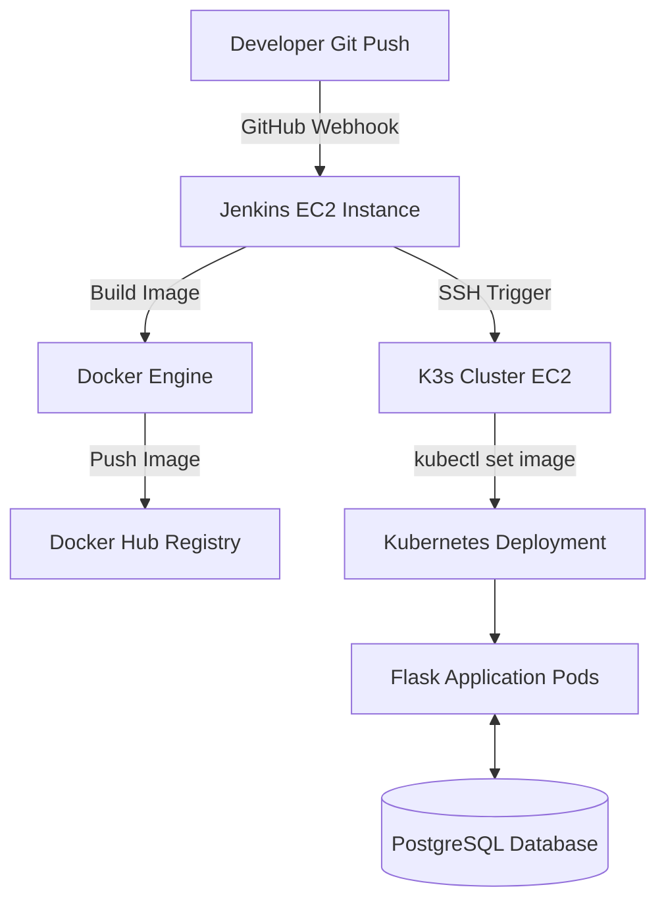

# 🎬 Movie Journal

> **End-to-End DevOps Project** featuring Flask, Docker, Kubernetes (K3s), Jenkins, Terraform, Ansible, Prometheus, Grafana, & AWS.

---

## 📌 Overview

**Movie Journal** is a full-stack web application that allows movie enthusiasts to catalogue their favorite films, manage custom posters, track memorable scenes, and write detailed reviews. 

**The primary objective of this repository is to demonstrate a production-grade, automated CI/CD and Infrastructure-as-Code (IaC) workflow**—from bare-metal AWS provisioning to zero-downtime Kubernetes deployments.

---

## 📸 Demo & Screenshots

### 🌐 Web Application Interface
| Main Movies Page | Movie Details & Scenes |
| :---: | :---: |
|  |  |

---

### 🚀 CI/CD Pipeline (Jenkins)
| Automated Pipeline Build |
| :---: |
|  |

---

### 📊 Observability & Monitoring
| Grafana Dashboard |
| :---: | :---: |
|  | 

---

## 🚀 Features

- **Film Management:** Add, review, and delete movies with custom ratings.
- **Rich Media Storage:** Upload custom poster art, backdrop imagery, and memorable scene snapshots.
- **Interactive UI:** Responsive, dark-themed interface built for fast browsing.
- **Relational Backend:** Powered by PostgreSQL and SQLAlchemy for reliable data persistence.

---

## 🛠️ Tech Stack & Tools

| Domain | Technologies |
| :--- | :--- |
| **Application** |     |
| **DevOps & CI/CD** |    |
| **Infrastructure** |    |
| **Observability** |   |

---

## 🏗️ Architecture & Pipeline Flow



### CI/CD Deployment Stages

```
Git Push ➔ GitHub Webhook ➔ Jenkins Build ➔ Docker Push ➔ SSH to Cluster ➔ Rolling K8s Update
```

---

## 📁 Project Structure

```text
movies/
├── 📁 ansible/        # Configuration management playbooks
├── 📁 kubernetes/     # Manifests (Deployments, Services, Ingress, Secrets)
├── 📁 monitoring/     # Prometheus & Grafana Helm values
├── 📁 static/         # Frontend CSS, JS, and image uploads
├── 📁 templates/      # Jinja2 HTML templates
├── 📁 terraform/      # AWS Infrastructure provisioning (VPC, EC2, SG)
├── Dockerfile         # App containerization specification
├── Jenkinsfile        # CI/CD pipeline definitions
├── movies.py          # Main Flask application entrypoint
├── seed_movies.py    # Database seeding utility
└── requirements.txt   # Python dependencies
```

---

## ☸️ Kubernetes Infrastructure

The cluster is managed via K3s and utilizes the following native Kubernetes resources:

- **Namespace:** Isolated environment for application resources.
- **Deployments:** Scalable web application and PostgreSQL instances.
- **Services:** Internal ClusterIP communication channels.
- **ConfigMap & Secret:** Safe separation of application configs and environment variables.
- **Ingress:** HTTP routing and external access management.

---

## 📊 Observability & Monitoring

The observability stack is deployed via **Helm** in the `monitoring` namespace and exposed externally via `NodePort`:

- **Grafana Dashboard:**  
  - **URL:** `http://<K3S_NODE_PUBLIC_IP>:30080`
  - Used for visual monitoring of application traffic, HTTP latency, and cluster node health.

- **Prometheus Metrics:**  
  - **URL:** `http://<K3S_NODE_PUBLIC_IP>:30090`
  - Collects and scrapes real-time application metrics exported via `prometheus_flask_exporter`.

---

## ⚡ Deployment & Setup Guide

<details>
<summary><b>Step 1: Clone the Repository</b></summary>

```bash
git clone https://github.com/your-username/movie-journal.git
cd movie-journal
```

</details>

<details>
<summary><b>Step 2: Create AWS Resources</b></summary>

Create an S3 bucket for Terraform remote state.

```bash
aws s3 mb s3://my-movie-tfstate-bucket --region eu-north-1
```

Make sure the bucket name matches the one configured in:

```text
terraform/backend.tf
```

Example:

```hcl
terraform {
  backend "s3" {
    bucket = "my-movie-tfstate-bucket"
    key    = "movie-app/terraform.tfstate"
    region = "eu-north-1"
  }
}
```

> **Important:** The S3 bucket must exist before running `terraform init`.

</details>

<details>
<summary><b>Step 3: Create SSH Key and Docker Hub Token</b></summary>

Before provisioning and configuring the servers, make sure you have:

### SSH Key

Create an SSH key for accessing the EC2 instances and save it as:

```text
~/.ssh/movies
```

The corresponding public key should be used when creating the EC2 instances.

### Docker Hub Token

Create a Docker Hub access token that Jenkins will use to authenticate with Docker Hub.

You will add this token to Jenkins in a later step.

</details>

<details>
<summary><b>Step 4: Provision AWS Infrastructure (Terraform)</b></summary>

Go to the Terraform directory:

```bash
cd terraform
```

Initialize Terraform:

```bash
terraform init
```

Create the infrastructure:

```bash
terraform plan
terraform apply
```

Terraform provisions the required AWS infrastructure, including:

- VPC and networking
- Security Groups
- Jenkins EC2 instance
- Movie application EC2 instance

After Terraform finishes, note the public IP addresses from the Terraform outputs.

</details>

<details>
<summary><b>Step 5: Update the Ansible Inventory</b></summary>

After Terraform creates the EC2 instances, update:

```text
ansible/inventory.txt
```

with the public IP addresses of the newly created servers.

The inventory should also specify the SSH user and private key:

```ini
[movies]
13.51.139.216 ansible_user=ubuntu ansible_ssh_private_key_file=~/.ssh/movies

[jenkins]
56.228.39.83 ansible_user=ubuntu ansible_ssh_private_key_file=~/.ssh/movies
```

Replace the IP addresses with the actual public IP addresses returned by Terraform.

> **Important:** If the EC2 instances are recreated and receive new IP addresses, update `inventory.txt` before running the Ansible playbooks.

</details>

<details>
<summary><b>Step 6: Configure Server Instances (Ansible)</b></summary>

From the Ansible directory:

```bash
cd ../ansible
```

Install and configure Jenkins:

```bash
ansible-playbook -i inventory.txt jenkins.yml
```

Provision Docker and K3s on the movie application server:

```bash
ansible-playbook -i inventory.txt movies.yml
```

</details>

<details>
<summary><b>Step 7: Update IP Address in the Jenkinsfile</b></summary>

Open:

```text
Jenkinsfile
```

Update the hardcoded `SERVER_IP` with the **public IP address of the movie application server** created by Terraform.

For example:

```groovy
environment {
    SERVER_IP = '13.51.139.216'
}
```

Replace `13.51.139.216` with your actual movie server IP address.

</details>

<details>
<summary><b>Step 8: Configure Jenkins Plugins</b></summary>

Open Jenkins:

```text
http://<JENKINS_PUBLIC_IP>:8080
```

Install the plugins required by the pipeline, including:

- **Git**
- **GitHub**
- **Credentials Binding**
- **SSH Agent**
- **Pipeline**
- **Docker Pipeline**
- **Kubernetes CLI** if required by the Jenkinsfile

</details>

<details>
<summary><b>Step 9: Add Jenkins Credentials</b></summary>

Go to:

```text
Jenkins → Manage Jenkins → Credentials
```

Add the credentials created earlier:

### Docker Hub

```text
ID: movie-docker-token-id
```

Use your Docker Hub username and access token.

### SSH Key

```text
ID: movie-ec2-key
```

Add the private SSH key used to access the movie application server.

> **Important:** The credential IDs must match the IDs referenced in the `Jenkinsfile`.

</details>

<details>
<summary><b>Step 10: Configure Jenkins Pipeline</b></summary>

Create a new Jenkins Pipeline job:

```text
New Item → Pipeline
```

Select:

```text
Definition:
Pipeline script from SCM

SCM:
Git

Repository:
https://github.com/your-username/movie-journal.git

Script Path:
Jenkinsfile
```

Enable:

```text
GitHub hook trigger for GITScm polling
```

</details>

<details>
<summary><b>Step 11: Configure the GitHub Webhook</b></summary>

Open:

```text
GitHub Repository → Settings → Webhooks
```

Add:

```text
http://<JENKINS_PUBLIC_IP>:8080/github-webhook/
```

Replace `<JENKINS_PUBLIC_IP>` with the public IP address of the Jenkins server.

Set the content type to:

```text
application/json
```

Select:

```text
Just the push event
```

</details>

<details>
<summary><b>Step 12: Trigger the Automated Deployment</b></summary>

Make a change to the repository and push it to GitHub:

```bash
git add .
git commit -m "feat: trigger deployment pipeline"
git push origin main
```

The GitHub webhook triggers Jenkins.

The pipeline then:

1. Pulls the latest source code.
2. Builds the Docker image.
3. Pushes the image to Docker Hub.
4. Connects to the K3s server.
5. Updates the Kubernetes deployment.
6. Waits for the rollout to complete.

Monitor the deployment from:

```text
Jenkins → Pipeline Job → Console Output
```

</details>

<details>
<summary><b>Step 13: Verify and Access the Application</b></summary>

After the Jenkins pipeline completes successfully, verify the Kubernetes resources:

```bash
kubectl get pods -n movie-space
kubectl get services -n movie-space
kubectl get ingress -n movie-space
```

Check the Ingress output:

```bash
kubectl get ingress -n movie-space
```

The application can then be accessed through the configured Ingress address or domain.

For example:

```text
http://<MOVIE_SERVER_IP>
```

Open the address in a browser to access the Movie Journal website. 🎬

</details>