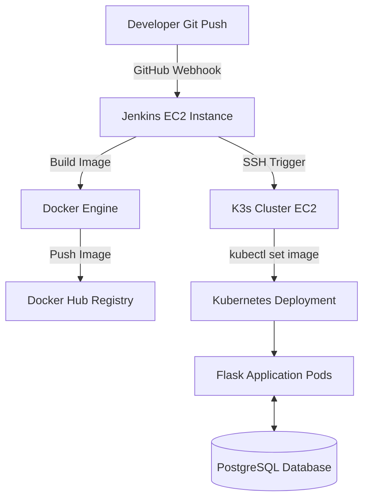

# 🎬 Movie Journal

> **End-to-End DevOps Project** featuring Flask, Docker, Kubernetes (K3s), Jenkins, Terraform, Ansible, Prometheus, Grafana, & AWS.

---

## 📌 Overview

**Movie Journal** is a full-stack web application that allows movie enthusiasts to catalogue their favorite films, manage custom posters, track memorable scenes, and write detailed reviews. 

**The primary objective of this repository is to demonstrate a production-grade, automated CI/CD and Infrastructure-as-Code (IaC) workflow**—from bare-metal AWS provisioning to zero-downtime Kubernetes deployments.

---

## 📸 Demo & Screenshots

### 🌐 Web Application Interface
| Main Movies Page | Movie Details & Scenes |
| :---: | :---: |
|  |  |

---

### 🚀 CI/CD Pipeline (Jenkins)
| Automated Pipeline Build |
| :---: |
|  |

---

### 📊 Observability & Monitoring
| Grafana Dashboard |
| :---: | :---: |
|  | 

---

## 🚀 Features

- **Film Management:** Add, review, and delete movies with custom ratings.
- **Rich Media Storage:** Upload custom poster art, backdrop imagery, and memorable scene snapshots.
- **Interactive UI:** Responsive, dark-themed interface built for fast browsing.
- **Relational Backend:** Powered by PostgreSQL and SQLAlchemy for reliable data persistence.

---

## 🛠️ Tech Stack & Tools

| Domain | Technologies |
| :--- | :--- |
| **Application** |     |
| **DevOps & CI/CD** |    |
| **Infrastructure** |    |
| **Observability** |   |

---

## 🏗️ Architecture & Pipeline Flow



### CI/CD Deployment Stages

```
Git Push ➔ GitHub Webhook ➔ Jenkins Build ➔ Docker Push ➔ SSH to Cluster ➔ Rolling K8s Update
```

---

## 📁 Project Structure

```text
movies/
├── 📁 ansible/        # Configuration management playbooks
├── 📁 kubernetes/     # Manifests (Deployments, Services, Ingress, Secrets)
├── 📁 monitoring/     # Prometheus & Grafana Helm values
├── 📁 static/         # Frontend CSS, JS, and image uploads
├── 📁 templates/      # Jinja2 HTML templates
├── 📁 terraform/      # AWS Infrastructure provisioning (VPC, EC2, SG)
├── Dockerfile         # App containerization specification
├── Jenkinsfile        # CI/CD pipeline definitions
├── movies.py          # Main Flask application entrypoint
├── seed_movies.py    # Database seeding utility
└── requirements.txt   # Python dependencies
```

---

## ☸️ Kubernetes Infrastructure

The cluster is managed via K3s and utilizes the following native Kubernetes resources:

- **Namespace:** Isolated environment for application resources.
- **Deployments:** Scalable web application and PostgreSQL instances.
- **Services:** Internal ClusterIP communication channels.
- **ConfigMap & Secret:** Safe separation of application configs and environment variables.
- **Ingress:** HTTP routing and external access management.

---

## 📊 Observability & Monitoring

The observability stack is deployed via **Helm** in the `monitoring` namespace and exposed externally via `NodePort`:

- **Grafana Dashboard:**  
  - **URL:** `http://<K3S_NODE_PUBLIC_IP>:30080`
  - Used for visual monitoring of application traffic, HTTP latency, and cluster node health.

- **Prometheus Metrics:**  
  - **URL:** `http://<K3S_NODE_PUBLIC_IP>:30090`
  - Collects and scrapes real-time application metrics exported via `prometheus_flask_exporter`.

---

## ⚡ Deployment & Setup Guide

<details>
<summary><b>Step 1: Clone the Repository</b></summary>

```bash
git clone https://github.com/your-username/movie-journal.git
cd movie-journal
```

</details>

<details>
<summary><b>Step 2: Create the S3 Bucket for Terraform State</b></summary>

Create an S3 bucket that will be used to store the Terraform remote state.

You can create the bucket from the AWS Console or with AWS CLI:

```bash
aws s3 mb s3://my-movie-tfstate-bucket --region eu-north-1
```

Make sure the bucket name matches the name configured in:

```text
terraform/backend.tf
```

For example:

```hcl
terraform {
  backend "s3" {
    bucket = "my-movie-tfstate-bucket"
    key    = "movie-app/terraform.tfstate"
    region = "eu-north-1"
  }
}
```

> **Important:** The S3 bucket must exist before running `terraform init`.

</details>

<details>
<summary><b>Step 3: Configure Terraform Variables</b></summary>

Go to the Terraform directory:

```bash
cd terraform
```

Review the Terraform configuration and make sure the AWS region, instance types, key pair name, and other required variables match your environment.

For example:

```bash
terraform.tfvars
```

If you are using an existing AWS EC2 key pair, make sure its name matches the value used by Terraform.

Then initialize Terraform:

```bash
terraform init
```

</details>

<details>
<summary><b>Step 4: Provision AWS Infrastructure (Terraform)</b></summary>

Create the AWS infrastructure:

```bash
terraform plan
terraform apply
```

Terraform provisions the required infrastructure, including:

- AWS VPC and networking
- Security Groups
- Jenkins EC2 instance
- Movie application EC2 instance
- Required AWS resources

After Terraform finishes, note the public IP addresses from the Terraform outputs.

For example:

```text
jenkins_public_ip = xx.xx.xx.xx
movie_server_public_ip = xx.xx.xx.xx
```

These IP addresses will be required in the Ansible inventory and Jenkins configuration.

</details>

<details>
<summary><b>Step 5: Update the Ansible Inventory</b></summary>

After Terraform creates the EC2 instances, update:

```text
ansible/inventory.txt
```

with the public IP addresses of the newly created servers.

For example:

```ini
[jenkins]
JENKINS_PUBLIC_IP

[movie]
MOVIE_SERVER_PUBLIC_IP
```

Replace the placeholders with the actual IP addresses returned by Terraform.

Example:

```ini
[jenkins]
12.34.56.78

[movie]
98.76.54.32
```

Also make sure the SSH user and private key configuration in the inventory or Ansible configuration match the EC2 instances.

> **Important:** If the EC2 instances are recreated and receive new public IP addresses, update `inventory.txt` again before running the Ansible playbooks.

</details>

<details>
<summary><b>Step 6: Configure Ansible SSH Access</b></summary>

Make sure Ansible can connect to the EC2 instances using SSH.

Test the connection:

```bash
ansible all -i inventory.txt -m ping
```

A successful connection should return:

```text
SUCCESS
```

If SSH access fails, verify:

- The EC2 instance is running.
- The IP address in `inventory.txt` is correct.
- The correct SSH private key is being used.
- The EC2 Security Group allows SSH on port `22`.
- The correct remote user is configured.

</details>

<details>
<summary><b>Step 7: Configure Server Instances (Ansible)</b></summary>

From the Ansible directory:

```bash
cd ../ansible
```

Install and configure Jenkins on the CI/CD server:

```bash
ansible-playbook -i inventory.txt jenkins.yml
```

Provision Docker and K3s on the movie application server:

```bash
ansible-playbook -i inventory.txt movies.yml
```

The Ansible playbooks configure the servers with the required software and deployment environment.

</details>

<details>
<summary><b>Step 8: Update IP Addresses in the Jenkinsfile</b></summary>

After the EC2 instances are created, check the repository's:

```text
Jenkinsfile
```

If the pipeline contains a hardcoded server IP address, update it with the **new public IP address of the movie application server**.

For example:

```groovy
environment {
    SERVER_IP = 'MOVIE_SERVER_PUBLIC_IP'
}
```

Replace:

```text
MOVIE_SERVER_PUBLIC_IP
```

with the actual IP returned by Terraform.

### When do you need to update the Jenkinsfile?

You need to update the Jenkinsfile whenever the application server's IP address changes.

For example, if Terraform destroys and recreates the EC2 instance:

```text
Old movie server IP
        ↓
EC2 destroyed
        ↓
New EC2 instance created
        ↓
New public IP
        ↓
Update Jenkinsfile
        ↓
Commit and push changes
```

> **Important:** Do not update the Jenkinsfile with the Jenkins server IP. The deployment target should be the **movie application / K3s server IP**.

</details>

<details>
<summary><b>Step 9: Configure Jenkins Plugins</b></summary>

Open Jenkins:

```text
http://<JENKINS_PUBLIC_IP>:8080
```

Install the plugins required for the CI/CD pipeline.

The exact plugin list may vary depending on the Jenkins configuration, but the pipeline requires support for GitHub, credentials, Docker, SSH, and pipeline execution.

Recommended plugins include:

- **Git**
- **GitHub**
- **GitHub Integration**
- **Credentials Binding**
- **SSH Agent**
- **Pipeline**
- **Docker Pipeline**
- **Docker**
- **Kubernetes CLI** if the pipeline uses the `kubectl` Jenkins integration

After installing the plugins, restart Jenkins if required.

</details>

<details>
<summary><b>Step 10: Add Jenkins Credentials</b></summary>

Go to:

```text
Jenkins → Manage Jenkins → Credentials
```

Add the credentials required by the pipeline.

### Docker Hub credentials

Create credentials for Docker Hub:

```text
ID: movie-docker-token-id
```

Use your Docker Hub username and access token.

The Jenkinsfile should reference the same credential ID:

```groovy
credentialsId: 'movie-docker-token-id'
```

### SSH private key

Add the private SSH key used to access the movie application server.

For example:

```text
ID: movie-ec2-key
```

The Jenkinsfile should reference the same credential ID when establishing the SSH connection.

> **Important:** The credential IDs in Jenkins must exactly match the IDs referenced in the Jenkinsfile.

</details>

<details>
<summary><b>Step 11: Configure Jenkins Pipeline</b></summary>

Create a new Jenkins Pipeline job.

Select:

```text
New Item → Pipeline
```

Configure Jenkins to use the repository's `Jenkinsfile`.

If using Pipeline script from SCM:

```text
Definition:
Pipeline script from SCM

SCM:
Git

Repository:
https://github.com/your-username/movie-journal.git

Script Path:
Jenkinsfile
```

Enable the GitHub webhook trigger:

```text
GitHub hook trigger for GITScm polling
```

</details>

<details>
<summary><b>Step 12: Configure the GitHub Webhook</b></summary>

Open:

```text
GitHub Repository → Settings → Webhooks
```

Add a webhook pointing to:

```text
http://<JENKINS_PUBLIC_IP>:8080/github-webhook/
```

Replace `<JENKINS_PUBLIC_IP>` with the public IP address of the Jenkins EC2 instance.

For example:

```text
http://12.34.56.78:8080/github-webhook/
```

Set the webhook content type to:

```text
application/json
```

Enable the option to trigger the webhook on:

```text
Just the push event
```

</details>

<details>
<summary><b>Step 13: Verify Jenkins Configuration</b></summary>

Before triggering a deployment, verify the following:

- [ ] Terraform infrastructure is running.
- [ ] S3 backend bucket exists.
- [ ] `ansible/inventory.txt` contains the current EC2 IP addresses.
- [ ] Ansible can connect to both servers.
- [ ] Jenkins is accessible on port `8080`.
- [ ] Required Jenkins plugins are installed.
- [ ] Docker Hub credentials are configured.
- [ ] SSH private key credentials are configured.
- [ ] Credential IDs match the Jenkinsfile.
- [ ] The Jenkinsfile contains the current movie server IP if required.
- [ ] GitHub webhook points to the current Jenkins public IP.

</details>

<details>
<summary><b>Step 14: Trigger the Automated Build and Deployment</b></summary>

After the infrastructure and Jenkins configuration are complete, make a change to the repository and push it to GitHub:

```bash
git add .
git commit -m "feat: trigger deployment pipeline"
git push origin main
```

The GitHub webhook triggers Jenkins.

The pipeline then:

1. Pulls the latest source code.
2. Builds the Docker image.
3. Pushes the image to Docker Hub.
4. Connects to the K3s server.
5. Updates the Kubernetes deployment.
6. Waits for the rollout to complete.

Monitor the deployment from:

```text
Jenkins → Your Pipeline Job → Console Output
```

</details>

<details>
<summary><b>Step 15: Verify the Application</b></summary>

After the Jenkins pipeline completes successfully, verify the Kubernetes deployment:

```bash
kubectl get pods
kubectl get services
kubectl get ingress
```

Check that the application pods are running:

```bash
kubectl get pods -n movie-space
```

Finally, access the application through the configured Ingress URL or domain.

🎬 **Deployment complete!**
</details>